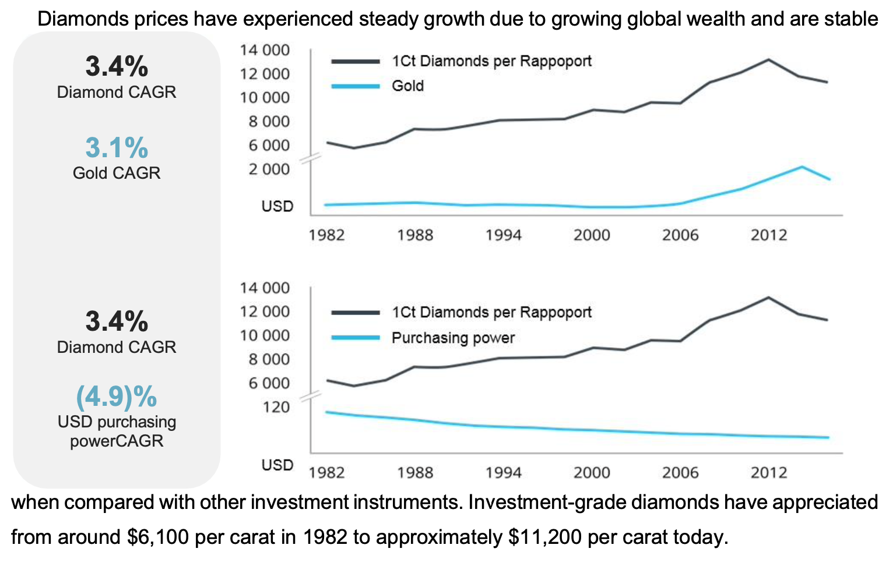
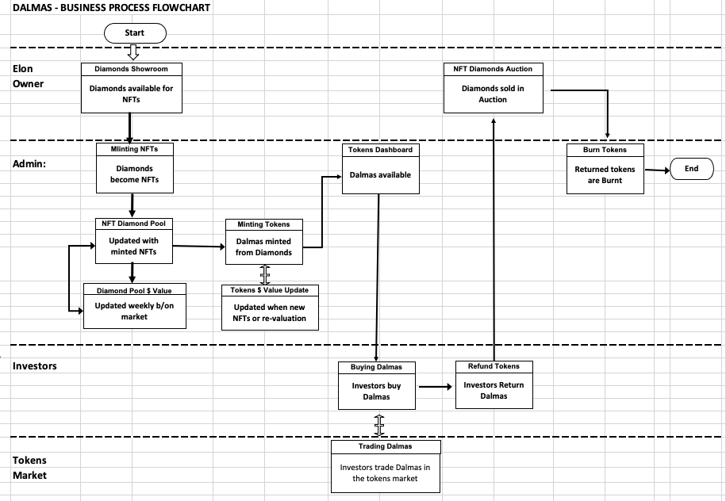
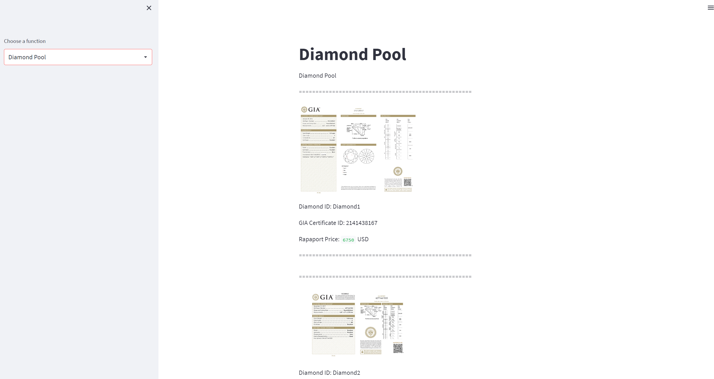
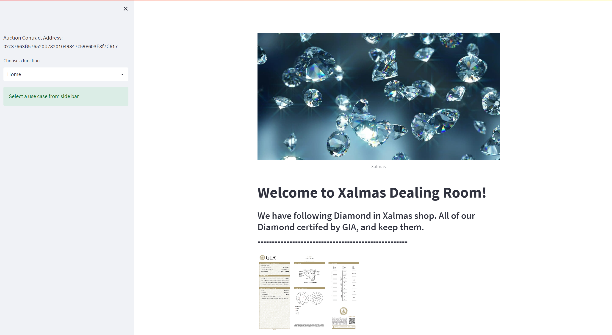
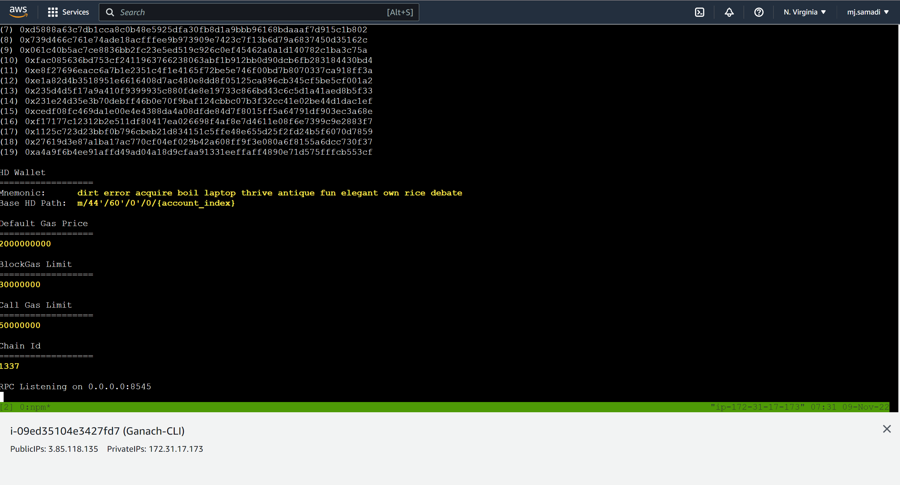
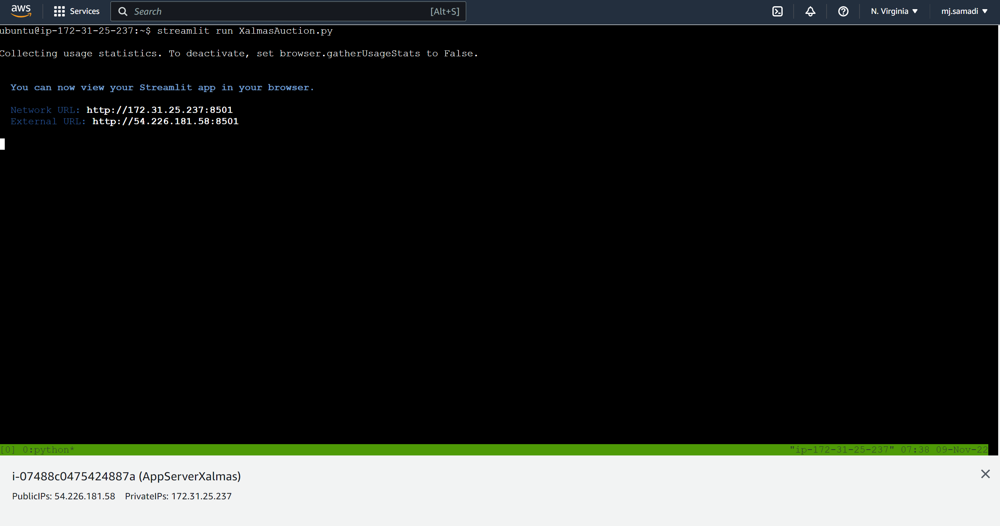
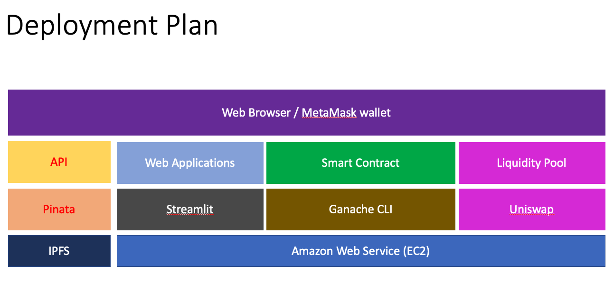

# Xalmas - Ecosystem for Digital Asset backed by Diamond 
By: FinTech Project 3 Group 2: FT32 Blockchain Consulting Group

# 1. Xalmas Ecosystem and Dalmas Tokens

Xalmas Ecosystem provides the architecture for the development and deployment of Dalmas. Dalmas is a token backed by natural high price Diamonds with an NFT Certificate of authenticiy and valuation, the tokens are offered to investors and distributed worlwide with the use of blockchain technology.

 

## 1.1. Introduction

Elon Dumond, an international diamond trader, needs to expand its market for selling more diamonds. He identifies that one of the main challenges for the diamond market is to find more customers that can afford to pay for the high price of diamonds. Elon came up with with a business idea to attract more customers by offering certified and high_grade diamonds as an investement opportunity given the continuous value appreciation of diamonds, and by selling tokens that are backed by diamonds through the blockchain worldwide. Diamonds are an ideal asset for backing a token since they are rare, take a billion years to develop, have several millennia of history as a recognized store of value, and are small and therefore easily stored and transported.

Elon has contacted the FT32 Consulting Group for developing the technology solution that will enable his business idea.

### Problem definition

Selling diamonds to customers requires to overcome the following obstacles:
1) Perceived Distrust - Customers are afraid of investing in a non-physical asset that is not secured or guaranteed by a bank or financial institution
2) Limited market - Very few investors would have a large capital to afford investing in high priced diamonds  
3) Reduced accessibility - High priced diamonds are locked or heavily secured and they are not easily accessible to customers
4) Low Liquidity - The transaction of acquiring or selling a diamonds is complex and may require a long time
5) Skepticism to new technology - Blockchain is a new technology with an steep learning curve for customers and investors

### Solutions identification

#### Dalmas Business Approach: Offering an investment opportunity with better and more stable returns than the stock market index with undue risk

1) The value of the Dalmas tokens will be backed by real Diamonds that will be stored in secured and insured vaults located in global locations offered by brokers. Each diamond will have an NFT registering the diamond as an asset attached to the Dalmas tokens, once an NFT is minted then the registered diamond becomes the property of the shareholders who own the pool of Diamonds. The Diamonds will have an NFT that registers the identification number engraved on the diamonds together with the accompanying Gemological Institute of America (GIA) certification of the quality of the diamond
2) A low dollar value of the Dalmas token will allow investors to afford investing with as low as a $10 USD. It will make this investment opportunity accessible to million of investors across the world  
3) The Dalmas tokens will be accessible to any investor around the globe that has access to the internet. Dalmas tokens can be acquired from the Dalmas site, the transaction is completed directly in the blockchain without the intervention of any third party. Dalmas investors have access to the full information related to their investments.
4) Investors can get the refund for their tokens based on the updated token value; investors can exchange their Dalmas with other blockchain tokens via other platforms
5) The site for the Dalmas will provide a user friendly channel for investors to acquire and do transactions for the Dalmas Token without the frictions of learning about blockchain technology.

## 1.2. Diamond Market and Economy 

The long-term outlook for the diamond market is positive, with demand for natural diamonds expected to grow at about 2% to 5% every year. Much of this is driven by strong demand by the middle-class in the US, China and India. Furthermore, there is potential for higher returns because the global diamond supply is constrained as diamonds are a finite natural resource, and the demand-supply gap is thus projected to widen over time with a forecasted decrease in diamond production. As the value of the Dalmas token is tied to that of diamonds, the Dalmas token thus appreciate in value over time as diamonds continue to benefit from positive pricing forces, continuing the historical trend from 1960 to 2016.

 References: Whitepaper
 
## 1.3. Why Digital Asset ?
 Diamonds are an ideal asset backing for a token since they are rare, take a billion years to develop, have several millennia of history as a recognized store of value, and the ownership, identification and value can be certified.

Dalmas token is designed to leverage the security and accessibility of blockchain technology with the stability of traditional assets. Dalmas token is a diamond-backed token, with each token pegged to the value of a fraction of a pool of authentic, natural diamonds.

There are two relevant components for the Dalmas token; the Certificate of the Diamonds that backs the tokens and the tokens that represent a share of ownership of the pool of Diamonds. The Certificates will be registered as NFTs following ERC721 Standard and the Tokens will be minted following ERC20 standards.

A digital token, Dalmas, can also be traded for other blockchain tokens via market platforms such as DEX

## 1.4. Dalmas Business Process Flowchart
 

## 1.5. Xalmas Applications (Launchpad)

- Xalmas Show Room
It provides a list of the Diamonds and their relevant information; this application allows the minting of Diamonds and registration as as NFTs and the updates to the values of the Diamonds.

    

     http://54.226.181.58:8501

- Xalmas Investment Tool (Dalmas Token)
This module provides the tools for investors to purchase or return tokens for refunds. It provides information about the total tokens and it allow ADMIN to burn tokens that were returned.

    
         http://54.226.181.58:8502 

- Xalmas Dealing Room
This module allows the sale of Diamonds via auction to fetch the best value.

    

     http://54.226.181.58:8503

- Xalmas Decentralized Exchange
This application will lead to the exchange where Dalmas can be traded for other tokens in the blockchain market.

    

    https://app.uniswap.org/#/swap

## 1.6. Dalmas Tokenomics
The value of Dalmas tokens is backed by the value of real diamonds. Diamonds are certified by the Gemological Institute of America(“GIA”), and the serial number of the certificate is laser inscription on the body of the diamond. The price of each diamond in issuer offering is calculated upon Rapaport price plus side costs of receiving the GIA certificate. The Dalmas tokens value are derived directly by the total value of the NFT Diamond pool with the value of the Dalmas tokens to be updated for every additional NFT Diamond minted or when the value of the Diamonds is updated in the market as determined by the Rapaport report.

Dalmas tokens can also be exchangeable in Stellar DEX with other Stellar tokens; expanding their liquidity and benefiting Dalmas investors.

### The value of Dalmas tokens is determined as follows:

- Dalmas token initial value. It is determined by the total value of the NFT Diamonds pool divided by the # of tokens determined when launching Xalmas. It is anticipated that the initial value of each Dalma should be small enough to attract a large number of customers. 

            Dalmas Token initial value = Total Value of NFT Diamonds / Initial number of Tokens supplied

- Dalmas Tokens - Updated value. 

    With Diamond Valuation:

            Dalmas Updated Token Value = Total Updated Value of NFT Diamonds  / Total number of tokens supplied

    When adding new Diamond(s): The principle is that all tokens have the same value independently of when they were minted. It is a 2 step process.
    
        Step 1: Calculate the Total number of additional tokens = Total Updated Value of NFT Diamonds (including the added diamond) / Dalmas Token Current Value
    
        Step 2: Mint the required Additional tokens

### Dalmas returned 
- Investors can return their Dalmas tokens and get a refund based on an updated value. The returned tokens are then burned.

### Dalmas trading
- Dalmas tokens can also be exchangeable in Stellar DEX with other Stellar tokens; expanding their liquidity and benefiting Dalmas investors.

# 2. Xalmas Could Deployment 

- Ganache CLI on AWS EC2
    

- Streamlit Application Server on ASW EC2
    

## 2.1. Technical Architecture 
 ...

## 2.2. Technology Stack 

 - Solidity 
 - Ganache
 - Streamlit 
 - Wallet Connect
 - MetaMask
 - AWS EC2
 - Python
 - Ethereum 
 - Remix

## 2.3. Deployment Plan 

 ...

## 2.4. Videos
  
  1- Smart Contract Deplyment 

       /Videos/1-XalmasSmartContractDeployment.mp4

  2- Issuing Xalmas NFT

        /Videos/2-XalmasShowRoom(NFT).mp4

  3- Xalmas Auction platform 

        /Videos/3-XalmasDealingRoom(Auction).mp4
  4- Issuing Dalmas Token and crwodsale

        /Videos/4-DalmasTokenIssueandCrowdsale.mp4

  5- List and Trade Dalmas Token on Uniswap

        /Videos/5-DalmasListingandTradingUniswapDEX.mp4

## 2.5. User Manuals
 
 ...

## 2.6. Future Development 
 
 1) Develop an internet site for the deployment of Xalmas
 2) 
 ...

## 2.7. References

- https://www.coindesk.com/business/2022/08/26/blockchain-startup-aims-to-open-the-1t-diamond-market-to-more-investors/

- https://artmeetsjewellery.com/gemstone-tokenization-nft-diamonds/

- https://icecap.diamonds/why-tokenize/

- https://levelup.gitconnected.com/the-7-types-of-cryptocurrencies-you-must-know-3b26b2ce0eb8

## 2.8. Project Team 
 - Mohammad Samadi
- Javier Aramayo
- Omar Dabban
- Abhilesh Gaikwad
- Saiful Ahmed
- Ali Zaidi
