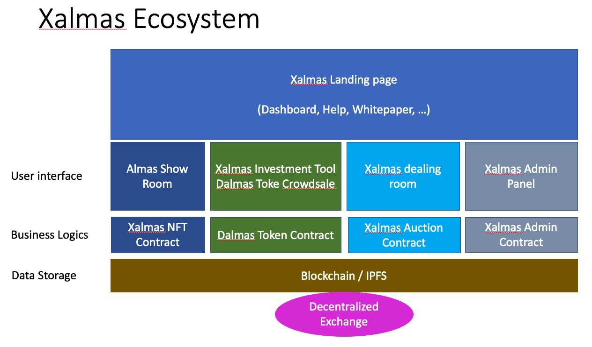
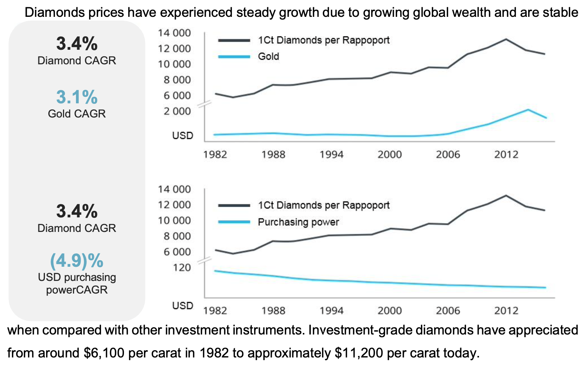
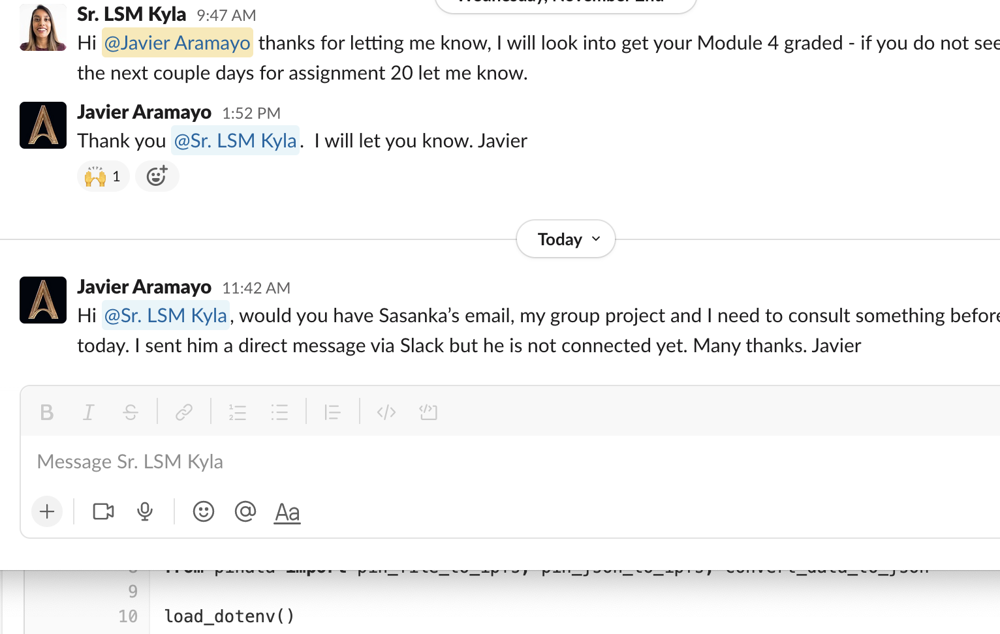
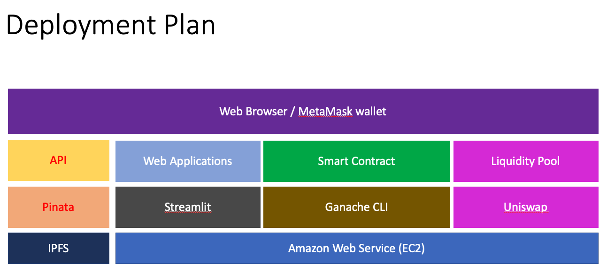

# Xalmas - Ecosystem for Digital Asset backed by Diamond 
By: FinTech Project 3 Group 2: FT32 Blockchain Consulting Group

# 1. Xalmas Ecosystem and Dalmas Tokens

Xalmas Ecosystem provides the architecture for the development and deployment of Dalmas. Dalmas is a token backed by natural high price Diamonds with an NFT Certificate of authenticiy and valuation, the tokens are offered to investors and distributed worlwide with the use of blockchain technology.

 

## 1.1. Introduction

Elon Dumond, an international diamond trader, needs to expand its market for selling more diamonds. He identifies that one of the main challenges for the diamond market is to find more customers that can afford to pay for the high price of diamonds. Elon came up with with a business idea to attract more customers by offering certified and high_grade diamonds as an investement opportunity given the continuous value appreciation of diamonds, and by selling tokens that are backed by diamonds through the blockchain worldwide. Diamonds are an ideal asset for backing a token since they are rare, take a billion years to develop, have several millennia of history as a recognized store of value, and are small and therefore easily stored and transported.

Elon has contacted the FT32 Consulting Group for developing the technology solution that will enable his business idea.

### Problem definition

Selling diamonds to customers requires to overcome the following obstacles:
1) Perceived Distrust - Customers are afraid of investing in a non-physical asset that is not secured or guaranteed by a bank or financial institution
2) Limited market - Very few investors would have a large capital to afford investing in high priced diamonds  
3) Reduced accessibility - High priced diamonds are locked or heavily secured and they are not easily accessible to customers
4) Low Liquidity - The transaction of acquiring or selling a diamonds is complex and may require a long time
5) Skepticism to new technology - Blockchain is a new technology with an steep learning curve for customers and investors

### Solutions identification

#### Dalmas Business Approach: Ofering an investment opportunity with better and more stable returns than the stock market index with undue risk

1) The value of the Dalmas tokens will be backed by real Diamonds that will be stored in secured and insured vaults located in global locations offered by brokers. Each diamond will have an NFT registering the diamond as an asset attached to the Dalmas tokens, once an NFT is minted then the registered diamond becomes the property of the shareholders who own the pool of Diamonds. The Diamonds will have an NFT that registers the identification number engraved on the diamonds together with the accompanying Gemological Institute of America (GIA) certification of the quality of the diamond
2) A low dollar value of the Dalmas token will allow investors to afford investing with as low as a $10 USD. It will make this investment opportunity accessible to million of investors across the world  
3) The Dalmas tokens will be accessible to any investor around the globe that has access to the internet. Dalmas tokens can be acquired from the Dalmas site, the transaction is completed directly in the blockchain without the intervention of any third party. Dalmas investors have access to the full information related to their investments.
4) Investors can get the refund for their tokens based on the updated token value; investors can exchange their Dalmas with other blockchain tokens via other platforms
5) The site for the Dalmas will provide a user friendly channel for investors to acquire and do transactions for the Dalmas Token without the frictions of learning about blockchain technology.

## 1.2. Diamond Market and Economy 

The long-term outlook for the diamond market is positive, with demand for natural diamonds expected to grow at about 2% to 5% every year. Much of this is driven by strong demand by the middle-class in the US, China and India. Furthermore, there is potential for higher returns because the global diamond supply is constrained as diamonds are a finite natural resource, and the demand-supply gap is thus projected to widen over time with a forecasted decrease in diamond production. As the value of the Dalmas token is tied to that of diamonds, the Dalmas token thus appreciate in value over time as diamonds continue to benefit from positive pricing forces, continuing the historical trend from 1960 to 2016.

 References: Whitepaper
 
## 1.3. Why Digital Asset ?
 Dalmas token is designed to leverage the security and accessibility of blockchain technology with the stability of traditional assets. Dalmas token is a diamond-backed token, with each token pegged to the value of a fraction of an authentic, natural diamonds.
 
 ...

## 1.4. Dalmas Business Process Flowchart
 

## 1.5. Xalmas Applications (Launchpad)

- Xalmas Show Room

- Xalmas Investment Tool (Dalmas Token)

- Xalmas Dealing Room 

- Xalmas Decentralized Exchange 

- Xalmas Administration Panel 

## 1.6. Dalmas Tokenomics
 ...

---

# 2. Xalmas Technical

 ...

## 2.1. Technical Architecture 
 ...

## 2.2. Technology Stack 
 ...

## 2.3. Deployment Plan 

 ...

## 2.4. Installation / Deployment Manuals 
 ...

## 2.5. User Manuals / Training Videos 
 
 
 
 ...

## 2.6. Future Development 
 ...

## 2.7. References

https://www.coindesk.com/business/2022/08/26/blockchain-startup-aims-to-open-the-1t-diamond-market-to-more-investors/

https://artmeetsjewellery.com/gemstone-tokenization-nft-diamonds/

https://icecap.diamonds/why-tokenize/

https://levelup.gitconnected.com/the-7-types-of-cryptocurrencies-you-must-know-3b26b2ce0eb8

## 2.8. Project Team 
 ...
 
